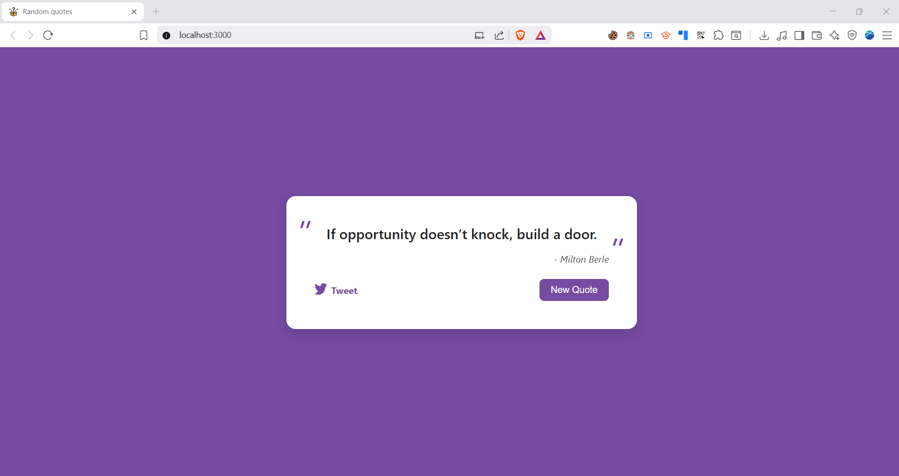

<p align="center">
  <a href="https://randomquotes-gray.vercel.app" target="_blank">
    
  </a>
</p>

<h1 align="center">RandomQuotes</h1>

<p align="center">
  <a href="https://randomquotes-gray.vercel.app" target="_blank">Live Demo</a> •
  <a href="#project-description">Project Description</a> •
  <a href="#features">Features</a> •
  <a href="#tech-stack">Tech Stack</a> •
  <a href="#installation">Installation</a> •
  <a href="#usage">Usage</a> •
  <a href="#credits">Credits</a>
</p>



---

## Project Description

RandomQuotes is a **simple and elegant web application** that fetches and displays random quotes from an external API. Built with **React** and **Vercel**, it offers users a refreshing dose of inspiration with each page load.

🔗 [Live Demo](https://randomquotes-gray.vercel.app)

---

## Features

- Displays a random quote with its author
- Clean and minimalistic design
- Responsive layout for mobile and desktop views
- Fetches quotes from an external API

---

## Tech Stack

- **Frontend**: React
- **Deployment**: Vercel

---

## Installation

```bash
git clone https://github.com/nca-gabriel/randomquotes.git
cd randomquotes
npm install
```
---


## Usage

Start the development server:

```bash
npm run dev
```

## Credits 
[Surprise box icon](https://www.flaticon.com/free-icon/surprise-box_6662934) created by [noomtah](https://www.flaticon.com/authors/noomtah) — [Flaticon](https://www.flaticon.com/)


